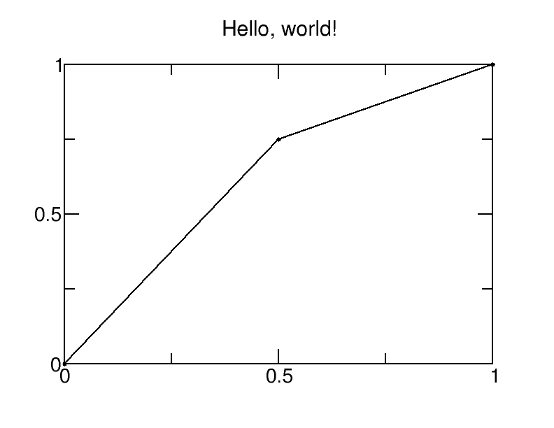
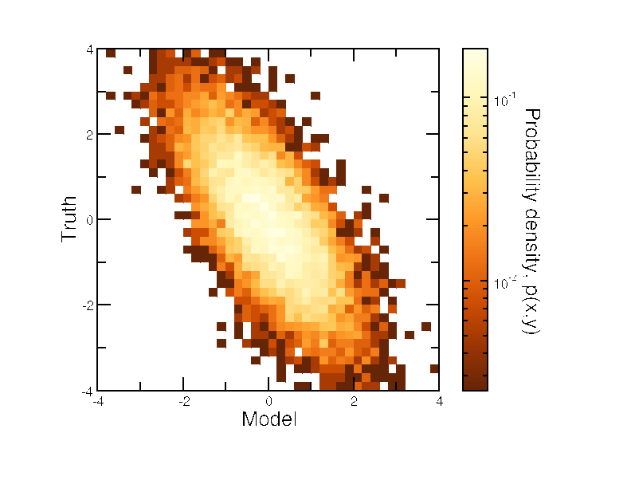
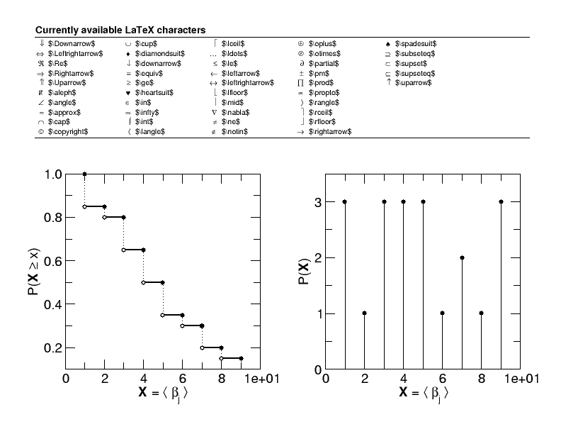
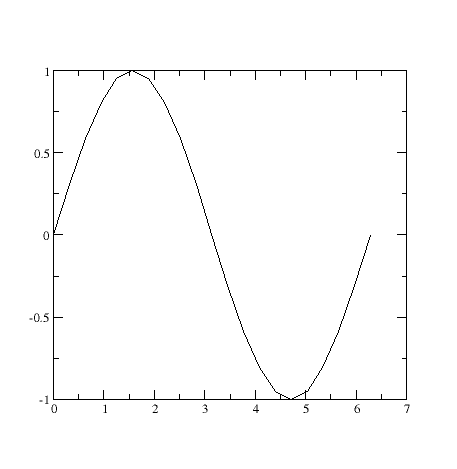
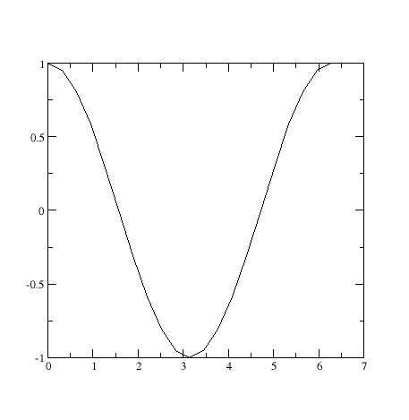
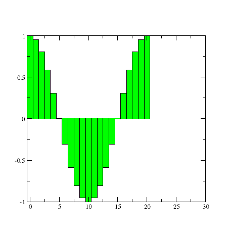

pygrace
=======
``pygrace`` is a set of Python bindings and wrappers for Grace.

Installation
------------
``pygrace`` can be installed by cloning the code from github, then running::

    $ python setup.py build
    $ python setup.py install

Build a Project File
--------------------
pygrace Project objects can be used to build complex project files.

start a pygrace project file::

    >>> from pygrace.project import Project
    >>> plot = Project()

add a Graph to the Project instance::

    >>> graph = plot.add_graph()
    >>> graph.title.text = 'Hello, world!'

add a DataSet to the graph::

    >>> data = [(0, 0), (0.5, 0.75), (1, 1)]
    >>> dataset = graph.add_dataset(data)

save the Project to a xmgrace project file (.agr format)::

    >>> plot.saveall('00_helloworld.agr')

then, open the project file with xmgrace::

    $ xmgrace 00_helloworld.agr

find out more about pygrace at http://pygrace.github.io or browse some more of the examples in [pygrace/examples](https://github.com/pygrace/pygrace/tree/master/pygrace/examples).

for example::

    $ python 05_colorplot.py
    $ xmgrace 05_colorplot.agr

and::

    $ python 08_latexlabels.py
    $ xmgrace 08_latexlabels.agr

Interactive Session
-------------------
we can also work in an interactive xmgrace session::

    >>> from pygrace import grace
    >>> pg = grace()

use xmgrace methods directly from the python interpreter::

    >>> import numpy as np
    >>> x = np.arange(21) * np.pi/10
    >>> pg.plot(x, np.sin(x))

push variables into xmgrace and interact with the xmgrace scripting language::

    >>> pg.put('x', x)
    >>> pg.put('y', np.cos(x))
    >>> pg.eval('s0 line color 2')
    >>> pg.eval('plot(x,y)')

use the interactive grace prompt::

    >>> pg.prompt()
    grace interface:
    vars=
         y
         x
    grace> histoPlot(y)
    grace> s0 fill color 3
    grace> redraw()
    grace> exit

check variables in grace session::

    >>> pg.who().keys()
    ['y', 'x']
    >>> pg.who('x')
    [0.0, 0.31415926535897931, 0.62831853071795862, 0.94247779607693793,
     1.2566370614359172, 1.5707963267948966, 1.8849555921538759,
     2.1991148575128552, 2.5132741228718345, 2.8274333882308138,
     3.1415926535897931, 3.455751918948772, 3.7699111843077517,
     4.0840704496667311, 4.3982297150257104, 4.7123889803846897,
     5.026548245743669, 5.3407075111026483, 5.6548667764616276,
     5.9690260418206069, 6.2831853071795862]

get variables back into python from xmgrace::

    >>> cosx = pg.get('y')

use shortcuts for put, eval, and get::

    >>> pg.z = 0.5
    >>> pg('print z')
    0.5
    >>> pg.z + 1
    1.5

delete variables from grace::

    >>> pg.delete('x')
    >>> pg.delete('y')
