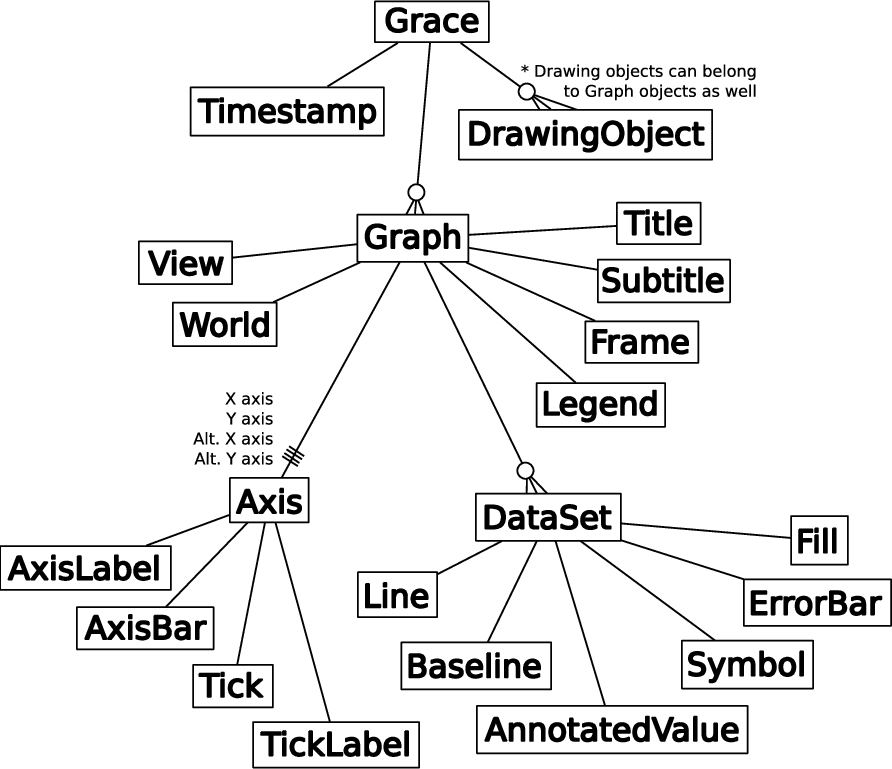

pygrace
=======
``pygrace`` is a set of Python bindings and wrappers for Grace.

Installation
------------
``pygrace`` can be installed by cloning the code from github, then running::

    $ python setup.py build
    $ python setup.py install

Build a Project File
--------------------
pygrace Project objects can be used to build complex project files.

start a pygrace project file::

    >>> from pygrace.project import Project
    >>> plot = Project()

add a Graph to the Project instance::

    >>> graph = plot.add_graph()
    >>> graph.title.text = 'Hello, world!'

add a DataSet to the graph::

    >>> data = [(0, 0), (0.5, 0.75), (1, 1)]
    >>> dataset = graph.add_dataset(data)

save the Project to a xmgrace project file (.agr format)::

    >>> plot.saveall('00_helloworld.agr')

then, open the project file with xmgrace::

    $ xmgrace 00_helloworld.agr

find out more about pygrace at http://pygrace.github.io or browse some more of the examples in [pygrace/examples](https://github.com/pygrace/pygrace/tree/master/pygrace/examples).

for example::

    $ python 05_colorplot.py
    $ xmgrace 05_colorplot.agr

and::

    $ python 08_latexlabels.py
    $ xmgrace 08_latexlabels.agr

Interactive Session
-------------------
we can also work in an interactive xmgrace session::

    >>> from pygrace import grace
    >>> pg = grace()

use xmgrace methods directly from the python interpreter::

    >>> import numpy as np
    >>> x = np.arange(21) * np.pi/10
    >>> pg.plot(x, np.sin(x))

push variables into xmgrace and interact with the xmgrace scripting language::

    >>> pg.put('x', x)
    >>> pg.put('y', np.cos(x))
    >>> pg.eval('s0 line color 2')
    >>> pg.eval('plot(x,y)')

use the interactive xmgrace prompt::

    >>> pg.prompt()
    grace interface:
    vars=
         y
         x
    grace> histoPlot(y)
    grace> s0 fill color 3
    grace> redraw()
    grace> exit

check variables in xmgrace session::

    >>> list(pg.who().keys())
    ['x', 'y']
    >>> pg.who('x')
    array([0.        , 0.31415927, 0.62831853, 0.9424778 , 1.25663706,
           1.57079633, 1.88495559, 2.19911486, 2.51327412, 2.82743339,
           3.14159265, 3.45575192, 3.76991118, 4.08407045, 4.39822972,
           4.71238898, 5.02654825, 5.34070751, 5.65486678, 5.96902604,
           6.28318531])

get variables back into python from xmgrace::

    >>> cosx = pg.get('y')

use shortcuts for put, eval, and get::

    >>> pg.z = 0.5
    >>> pg('print(z)')
    0.5
    >>> pg.z + cosx
    array([ 1.5       ,  1.45105652,  1.30901699,  1.08778525,  0.80901699,
            0.5       ,  0.19098301, -0.08778525, -0.30901699, -0.45105652,
           -0.5       , -0.45105652, -0.30901699, -0.08778525,  0.19098301,
            0.5       ,  0.80901699,  1.08778525,  1.30901699,  1.45105652,
            1.5       ])

delete variables from xmgrace::

    >>> pg.delete('x')
    >>> pg.delete('y')

save current session to a project file, then exit::

    >>> pg.saveall('histoPlot.agr')
    >>> pg.exit()

start a new interactive xmgrace session from the saved project::

    >>> pg = grace(project='histoPlot.agr')

